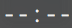
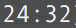

# Tmux gomodoro
Enables displaying gomodoro remain time in Tmux status line.  

## Installation

**Please install [gomodoro](https://github.com/hatappi/gomodoro) in advance**

### Installation with [Tmux Plugin Manager](https://github.com/tmux-plugins/tpm) (recommended)

Add plugin to the list of TPM plugins in `.tmux.conf`:

```bash
set -g @plugin 'hatappi/tmux-gomodoro'
```

Hit `prefix + I` to fetch the plugin and source it.

### Manual Installation

Clone the repo:

```bash
$ git clone https://github.com/hatappi/tmux-gomodoro.git ~/.tmux/plugins/tmux-gomodoro
```

Add this line to the bottom of `.tmux.conf`:

```bash
run-shell ~/.tmux/plugins/tmux-gomodoro/gomodoro.tmux
```

Reload TMUX environment:

```bash
$ tmux source-file ~/.tmux.conf
```


## Usage

Add `#{gomodoro_remain}` format strings to existing `status-left` or `status-right` tmux option.  

Example: .tmux.conf

```
# status-left example
set-option -g status-left-length 15
set -g status-left 'gomodoro[#{gomodoro_remain}]'

# status-right example
set -g status-right 'gomodoro[#{gomodoro_remain}] | %Y-%m-%d(%a) '
```


## Examples
Not Working or Not install gomodoro  


Working  



## License

[MIT](./LICENSE)